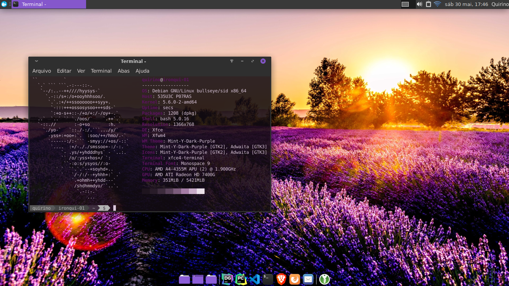
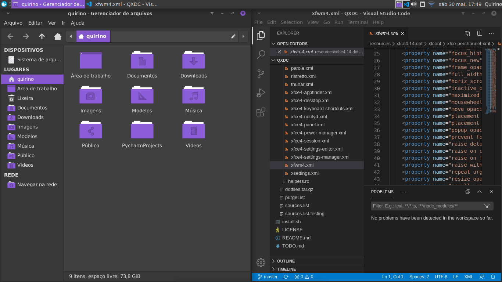

# QXDC → Quirino's XFCE Default Config

### Why?
We already have so many mods and styles for our desktops, but I usually need to reinstall and reinvent my usability options, so I don't wanna use any of all disponible "refisefuquis"¹, I've most used it on Debian Stable, but it works on Xubuntu and most Debian derivatives with XFCE4.

### ScreenShots

##### Added itens

Debian usually comes with a cleaner install, so I've add some applications and system items that I've missed.
In resources/include/systemTools.sh and resources/include/installBaseApplications.sh, you'll find a list with the added applications, so if you wanna keep any, just remove from the list, same idea to increment the list, but you are alone on that.

##### Uninstalled applications

  There are few applications that I usually don't need, so I've decided to uninstall them all.
  In resources/include/purgeApplications.sh you'll find a list with the applications that we purge, so if you wanna keep any, just remove from the list, same idea to increment the list, but you are alone on that.

##### View Install logs

  If you wanna see the install logs report, just:

      tail -f /tmp/QXDCinstall.log

###### Wordlists
1 - Refisefuquis -> In portuguese "Release de Fim de Semana e Fundo de Quintal", on a literal translation "Release from Weekend and Backyard", in simple words, releases with no suport, no inovations and no proposits, just a homemade adventure for a develover with time and a computer available.
